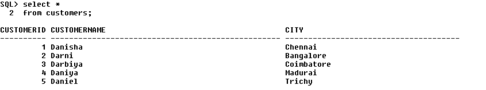
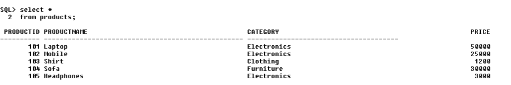
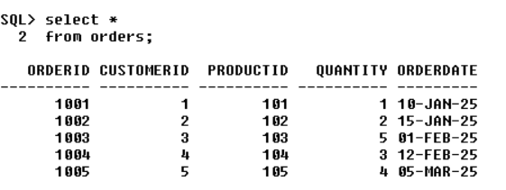
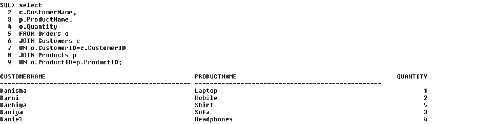
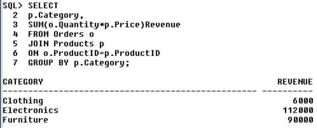
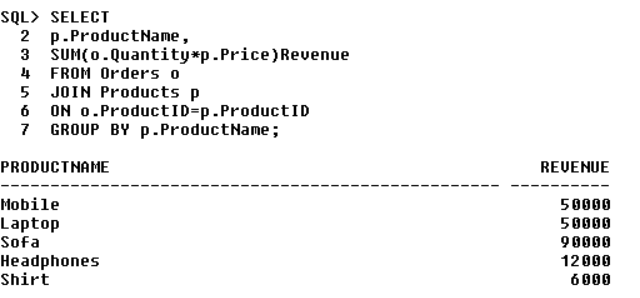
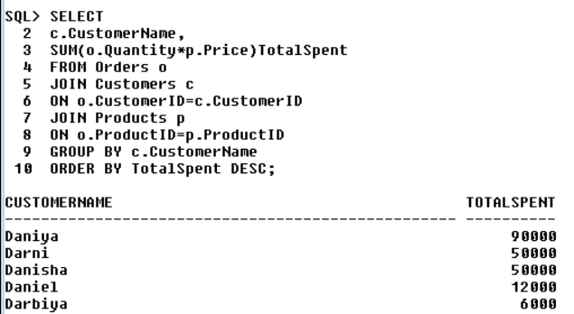
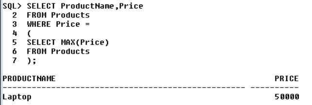
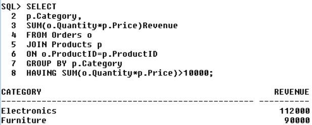
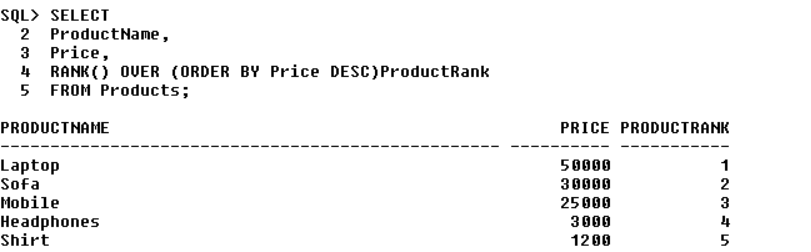

# SQL Mini E-Commerce Project

## Project Overview

This project demonstrates the design and analysis of a simple E-Commerce database using Oracle SQL. The database consists of Customers, Products, and Orders tables connected through Primary Key and Foreign Key relationships.

The project focuses on SQL concepts such as table creation, data insertion, joins, aggregations, filtering, subqueries, and window functions.

## Objectives

* Design a relational database for an E-Commerce system.
* Establish relationships between tables using Primary Keys and Foreign Keys.
* Perform business analysis using SQL queries.
* Generate insights related to customers, products, and sales.

## Database Tables

### Customers

Stores customer information such as Customer ID, Customer Name, and City.

### Products

Stores product details such as Product ID, Product Name, Category, and Price.

### Orders

Stores order information including Order ID, Customer ID, Product ID, Quantity, and Order Date.

## SQL Concepts Used

* CREATE TABLE
* INSERT INTO
* PRIMARY KEY
* FOREIGN KEY
* INNER JOIN
* GROUP BY
* ORDER BY
* HAVING
* Aggregate Functions (SUM, COUNT, MAX)
* Subqueries
* Window Functions (RANK)

## Analysis Performed

1. Customer Order Analysis using INNER JOIN.
2. Product Revenue Analysis.
3. Customer Spending Analysis.
4. Category-wise Revenue Analysis.
5. Revenue Filtering using HAVING Clause.
6. Highest Priced Product Analysis using Subquery.
7. Product Ranking using Window Functions.

## Key Insights

* Electronics category generated the highest revenue.
* Laptop was the highest priced product.
* Revenue was concentrated in Electronics products.
* Customer spending analysis identified top customers.
* Product ranking helped identify high-value products.

## Project Structure

SQL_Mini_Ecommerce_Project

* ecommerce_project.sql
* README.md
* screenshots/

## Tools Used

* Oracle SQL
* SQL*Plus
* GitHub

### Customers Table

### Products Table

### Orders Table

### Customer Order Analysis

### Revenue by Category

### Revenue by Product

### Top Customer Analysis

### Highest Priced Product Analysis

### Revenue Filtering using HAVING Clause

### Product Ranking Analysis

